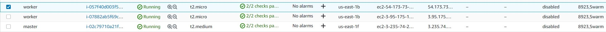
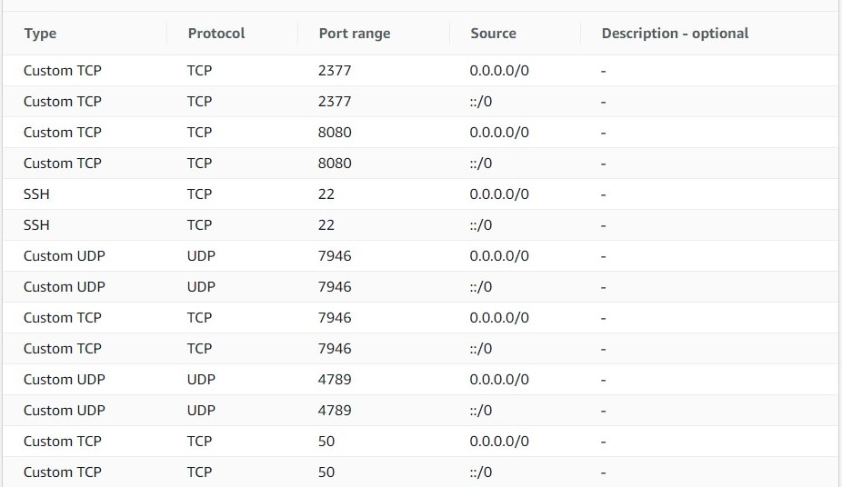
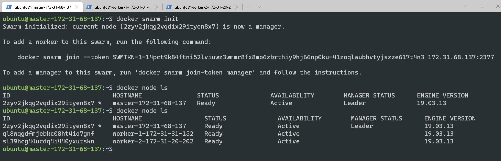
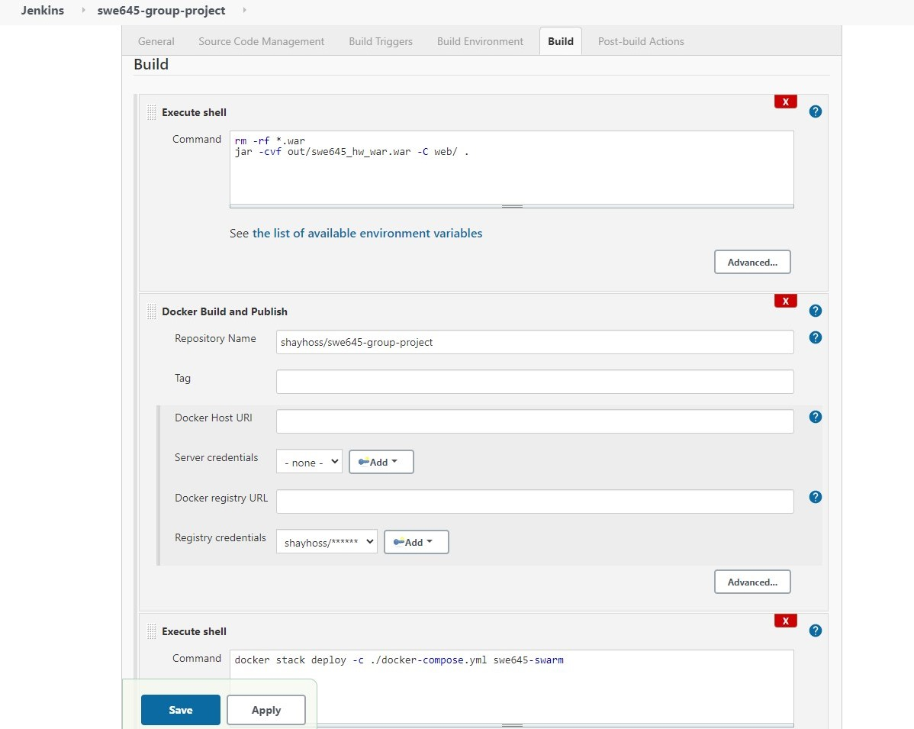
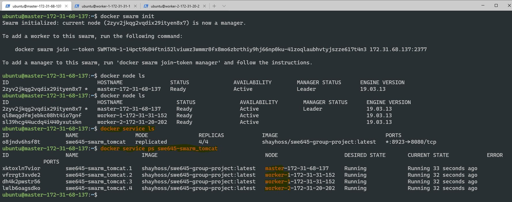

# SWE645-group-project

## Setting up GitHub

We use Github for hosting our application and providing version control. The public repository of our application can be found at [SWE645-group-project](https://github.com/popsps/SWE645-group-project).

### Webhook

We use webhooks to facilitate our pipeline. Our webhook will send a push request to our Master EC2 instance public DNS. Here is the URL we used: http://ec2-3-235-74-211.compute-1.amazonaws.com:8080/github-webhook/.

## Setting up Docker Hub

For this project we need a Docker Hub account. We publish our image into a public repository there. Here is the link to our public Docker repository: [shayhoss/swe645-group-project](https://hub.docker.com/r/shayhoss/swe645-group-project).

## Setting up EC2 Instances

We are setting up 3 Ubuntu EC2 instances. One will be the master and is a `t2.medium` instance. The other two will be workers and are `t2.micro` instances.



We will install Java, Jenkins and Docker for the master and Docker for worker nodes.

### Master Node installation Script

```sh
#!/bin/sh
# update packages
sudo apt update -y
# install Docker
curl -fsSL https://get.docker.com -o get-docker.sh
sudo sh get-docker.sh
# Give sudo privilage to Docker
sudo usermod -aG docker ubuntu
# Install Java this will be used to run Jenkins
sudo apt-get install -y default-jdk
# Install Jenkins
wget -q -O - https://pkg.jenkins.io/debian-stable/jenkins.io.key | sudo apt-key add -
sudo sh -c 'echo deb https://pkg.jenkins.io/debian-stable binary/ > \
    /etc/apt/sources.list.d/jenkins.list'
sudo apt-get update
sudo apt-get install jenkins
# Start Jenkins
sudo service jenkins start
```

### Worker Nodes installation

```sh
#!/bin/sh
# update packages
sudo apt update -y
# install Docker
curl -fsSL https://get.docker.com -o get-docker.sh
sudo sh get-docker.sh
# Give sudo privilage to Docker
sudo usermod -aG docker ubuntu
```

### Security Group

Open up ports 80, 8080, 22 to be able to communicate with instances. Also open up ports 2377, 7946, 4789, and 50 so Docker Swarm can function properly. Finally, open port 8923 to expose it to the clients.



## Image Configuration Using **Dockerfile**

```Dockerfile
FROM tomcat:latest AS swe645-orch
ADD out/swe645_hw_war.war  /usr/local/tomcat/webapps
EXPOSE 8080
```

This will create a container using tomcat:latest. Then add the war file into `webapps` directory of the container. Finally it will expose port 8080.

## Container Orchestration Using **YAML**

```yml
version: "3"
services:
  tomcat:
    image: shayhoss/swe645-group-project:latest
    deploy:
      replicas: 4
    ports:
      - "8923:8080"
```

This will create 4 replicas of `shayhoss/swe645-group-project` which is a public image of the container we built using our Dockerfile. It maps port 8080 to port 8923. That is because we are hosting Jenkins on port 8080.

## Setting up the clusters Using Docker Swarm

### Setting up the Master

To initialize a cluster we need to initiate a swarm on the Master(manager) node using

```sh
docker swarm init
```

This will generate a token that we can use in the workers to join this cluster.

### Setting up Workers

So we get the token and join the cluster. e.g.

```sh
# To add a worker to the cluster
docker swarm join --token SWMTKN-1-14pct9k84ftni52lviuwz3wmmr8fx8mo6zbrthiy9hj66np0ku-41zoqlaubhvtyjszze617t4n3 172.31.68.137:2377
```

Finally we can run

```sh
docker node ls
```

in the master node to see and verify the status of all nodes in the cluster.



## Setting up The Automation Using Jenkins(CI/CD)

### Plugins

After booting up your Jenkins for the first time, install all suggested plugins. Additionally we install `CloudBees Docker Build and Publish plugin` to be able to communicate with DockerHub.

### DockerHub Credential

Add DockerHub credential to the Jenkins credentials.

### Setup Automation and Build Tools

From the side bar select `new Item`. Create a `Free style project` and name it `swe645-group-project`. Next configure it as follows.

- General
  - GitHub project
    - Project url: https://github.com/popsps/SWE645-group-project/
- Source Code Management
  - Git
    - Repository URL: https://github.com/popsps/SWE645-group-project.git
- Build Triggers
  - GitHub hook trigger for GITScm polling
- Build
  - Execute shell
    ```sh
    # remove all previous war files
    rm -rf *.war
    # build the war file based on the content of the web directory and deploy it to the out directory.
    jar -cvf out/swe645_hw_war.war -C web/ .
    ```
  - Docker Build and publish
    - Repository Name: shayhoss/swe645-group-project
    - Register Credential: <dockerHub_Credential>
  - Execute shell
    ```sh
    # build the cluster using a YAML file
    docker stack deploy -c ./docker-compose.yml swe645-swarm
    ```

Here is the summary of Jenkins project

- Use Github repository to create a pipeline to the server running Jenkins.
- Set GitHub hook trigger so that whenever new code is pushed to the GitHub and GitHub pushes those changes to the Jenkins, Jenkins will automatically issue a new build.
- Build a war file based on the content of `web` directory
- Create an Image based on the `Dockerfile` and push it to the `shayhoss/swe645-group-project` repository.
- Create a cluster based on the `docker-compose.yml`.



After we configure the Jenkins we can push new changes to Github and it will build an image based on `Dockefile` then push it to the Ducker Hub. Finally we build 4 pods using `docker-compose.yml` we have provided.

## Verification

Finally we need to check and verify that are instances are up and running and the replicas are created using `shayhoss/swe645-group-project` image. Issue following commands on the Master to verify the status of the cluster.

```sh
# to check the status of the nodes(EC2 instances) in the cluster
docker node ls
# 4 containers are created across 3 nodes using yaml file.
# to check whether the service is created
docker service ls
# pass the service name as parameter to check the status of the service
docker service ps swe645-swarm_tomcat
```



Access the website at the public IP address(DNS) of master or any of the workers using port 8923.

#### Master

http://ec2-3-235-74-211.compute-1.amazonaws.com:8923/swe645_hw_war/index.html

#### Worker1

http://ec2-54-173-73-185.compute-1.amazonaws.com:8923/swe645_hw_war/index.html

#### Worker2

http://ec2-3-95-175-199.compute-1.amazonaws.com:8923/swe645_hw_war/index.html 
